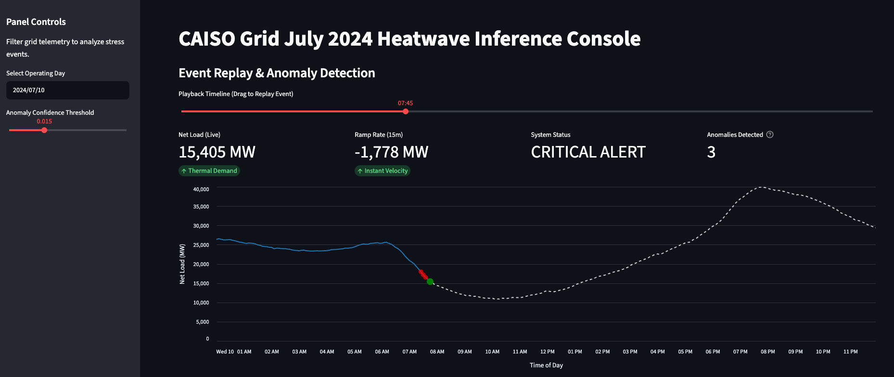

# ⚡ CAISO Grid Stability Simulator & Anomaly Detector


A "Digital Twin" reliability console that monitors California's power grid for stability risks. This project ingests real-time telemetry from CAISO, calculates physics-based stress indicators (like Ramp Rates and Net Load), and uses **Unsupervised Machine Learning (Isolation Forests)** to detect operational anomalies.



## 🚀 The Objective
California's energy transition has created the **"Duck Curve"**—a phenomenon where solar generation drops rapidly at sunset while consumer demand spikes. This creates extreme "Ramp Events" that threaten grid frequency.

**This project answers the question:** *Can we use Unsupervised Learning to automatically flag these complex stress events without relying on historical failure labels?*

## 🛠️ Architecture & Tech Stack

The system follows a classic **ELT (Extract, Load, Transform)** architecture hosted on AWS.

1.  **Ingestion:** Python scripts utilizing the `gridstatus` library to fetch 5-minute telemetry (Load, Solar, Wind) -> **AWS S3 (Raw)**.
2.  **Processing:** Feature engineering pipeline to calculate:
    *   **Net Load:** `Total Demand - Renewables`
    *   **Ramp Rate (15m):** `d(NetLoad) / dt` (Velocity of change)
    *   **Solar Volatility:** Rolling standard deviation of supply.
3.  **Modeling:** An **Isolation Forest** (Unsupervised) trained to identify high-dimensional outliers in the grid's operating envelope.
4.  **Visualization:** Interactive **Streamlit** dashboard with "Event Replay" capabilities.

## 📊 Key Features
*   **Event Replay Console:** A "Time-Machine" slider allowing operators to scrub through historical days and watch stress events evolve minute-by-minute.
*   **Physics-Aware Modeling:** The model doesn't just look at high demand; it looks at the *combination* of Demand, Ramp Velocity, and Solar Instability.
*   **Dynamic Thresholding:** Includes a sensitivity slider to tune the Signal-to-Noise ratio for the anomaly detector, simulating "Control Room" alert fatigue management.

## 💻 Installation & Usage

### Prerequisites
*   Python 3.10+
*   AWS Credentials (configured via `aws configure` or env variables) with S3 read/write access.

### Setup
1.  **Clone the repo**
    ```bash
    git clone https://github.com/yourusername/caiso-net-load-anomaly-detection.git
    cd caiso-net-load-anomaly-detection
    ```

2.  **Install Dependencies**
    ```bash
    pip install -r requirements.txt
    ```

3.  **Run the Pipeline (Populate S3)**
    ```bash
    # Step 1: Ingest Raw Data (Heatwave 2024 Event)
    python pipelines/01_ingest.py

    # Step 2: Calculate Physics Features
    python pipelines/02_process.py

    # Step 3: Train Model & Score Anomalies
    python pipelines/03_train_model.py
    ```

4.  **Launch the Dashboard**
    ```bash
    streamlit run app.py
    ```

## 🧠 Model Technical Details
*   **Algorithm:** `sklearn.ensemble.IsolationForest`
*   **Contamination Strategy:** Operates on a continuous scoring scale (Distance from Normal). The dashboard visualizes anomalies dynamically based on a user-defined threshold (Default: Top 2% outliers).
*   **Why Unsupervised?** Grid failures are "Black Swan" events. Supervised classification fails due to extreme class imbalance. Isolation Forests excel at detecting *novel* failure modes we haven't seen before.

## 🔮 Future Roadmap
*   [ ] **Alerting:** Add AWS SNS integration to send SMS alerts when Anomaly Score > 0.05.
*   [ ] **Containerization:** Dockerize the pipeline for deployment on AWS ECS.

---
*Built for the Public Interest / Utility Reliability Engineering community.*
